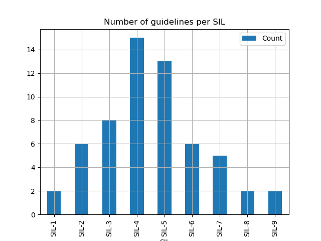
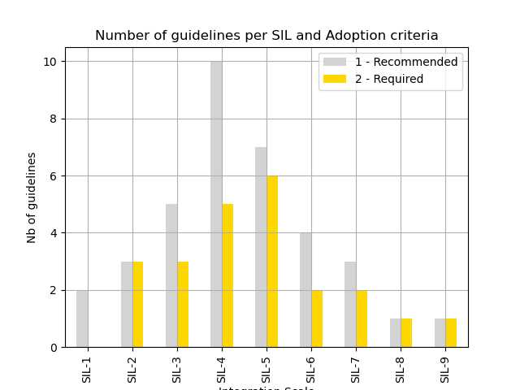
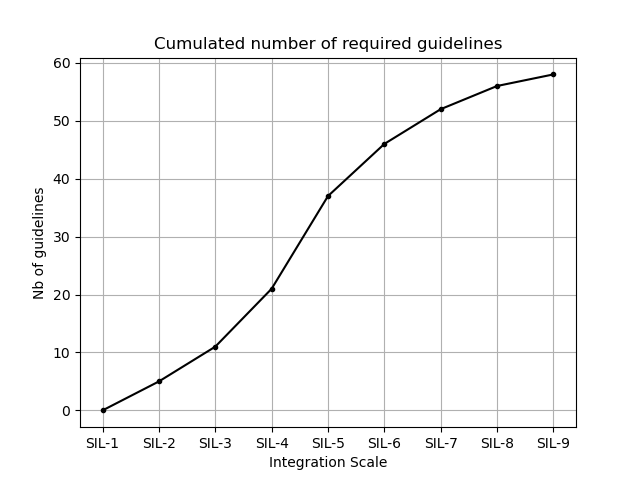

#  Argo Research Infrastructure: Software Integration Level (SIL)

A framework to assess the development stage and/or integration level of Argo-related software, from early concepts to foundational tools.

## About

The Argo Research Infrastructure (RI) Software Integration Level (SIL) is a framework designed to evaluate and guide the development of Argo-related software. It provides a structured pathway for software to evolve from initial concepts to foundational components of the Argo RI.

Note that all software projects are NOT envisioned to be foundational components of the RI. A software project should simply choose the SIL that suits best the team's ambition. Once a SIL is chosen, follow the guidelines !

The SIL framework can serve as both a development roadmap and a certification system, ensuring that software meets the Argo RI's standards for quality, interoperability, and community integration.

Here is the list of SIL titles:
- 🏆 SIL-1: Basic Concept Exploration 
- 🛠️ SIL-2: Functional Prototype 
- 🧪 SIL-3: Minimal Viable Research Software 
- 🔄 SIL-4: Structured Open-Source Project 
- ✅ SIL-5: Verified Research Software 
- 👥 SIL-6: Community-Driven Tool 
- 🏗️ SIL-7: Robust Open-Source Software
- 🌍 SIL-8: Mature Open-Source Software
- 🏛️ SIL-9: Foundational Software

**SIL certification:**

SILs are envisioned as a two-way improvement feature:
- It helps RI staff develop software by providing clear benchmarks and goals.
- It provides software with a RI certification, recognizing its compliance with Argo RI expectations at a given level.

In other words, the SIL framework not only guides developers in progressively improving their software to meet higher standards, but also serves as a recognition system, certifying that a software meets the Argo Research Infrastructure's expectations for quality, interoperability, and community integration at a given level.

The certification is self-declarative.

**SIL vs development guidelines:**

Each SIL is assigned a list of [Argo software development guidelines](https://github.com/euroargodev/software_guidelines/issues) categorized as:
- 1-Recommended: This guideline is strongly encouraged.
- 2-Required: This guideline is mandatory.

‼️ Guidelines marked as "1-Recommended" at a given SIL are upgraded as "2-Required" for any upper SIL. Therefore, the higher the SIL, the higher the number of required guidelines to follow.

## SIL Description


### 🏆 **SIL-1: Basic Concept Exploration**

- **Focus**: Early exploratory stage.
- **Description**: Initial research ideas or concepts often explored as a simple script or notebook.
- **Guidelines** (3): 
  - **Argo specific**:
    - The software should use a programming language adopted by the Argo community (Python, R, Java, Julia, Matlab/Octave) ([#58↗](https://github.com/euroargodev/software_guidelines/issues/58))
  - **General**:
    - The Project uses English as a primary language (eg: in documentation, codebase) ([#41↗](https://github.com/euroargodev/software_guidelines/issues/41))
    - The software is released under an open-source license ([#56↗](https://github.com/euroargodev/software_guidelines/issues/56))

### 🛠️ **SIL-2: Functional Prototype**

- **Focus**: Moving toward broader applicability.
- **Description**: Standalone code that expand the initial concept into a functional tool with a clear purpose.
- **Guidelines** (5): 
  - **Argo specific**:
    - The project includes a basic description of what it does with or to the Argo dataset (e.g. read index file, calibrate salinity, plot trajectory, assess BGC variables,...) ([#66↗](https://github.com/euroargodev/software_guidelines/issues/66))
  - **General**:
    - A version control tool is used to manage the codebase ([#1↗](https://github.com/euroargodev/software_guidelines/issues/1))
    - The project includes a basic documentation ([#36↗](https://github.com/euroargodev/software_guidelines/issues/36))
    - The project is hosted on a web-based development platform (e.g., GitHub or GitLab). ([#39↗](https://github.com/euroargodev/software_guidelines/issues/39))
    - The software uses an open-source programming language ([#59↗](https://github.com/euroargodev/software_guidelines/issues/59))

### 🧪 **SIL-3: Minimal Viable Research Software**

- **Focus**: Limited sharing and reproducibility.
- **Description**: The software is usable by collaborators in a limited context, with basic documentation and installation instructions.
- **Guidelines** (8): 
  - **Argo specific**:
    - The project acknowledges Argo data papers and/or DOIs ([#6↗](https://github.com/euroargodev/software_guidelines/issues/6))
    - Metadata produced by the software follow Argo conventions (as in reference tables provided by the Argo vocabulary server) ([#16↗](https://github.com/euroargodev/software_guidelines/issues/16))
    - The methodology implemented by the software has been presented to an Argo community ([#26↗](https://github.com/euroargodev/software_guidelines/issues/26))
  - **General**:
    - Each collaborator is clearly identified within the project ([#10↗](https://github.com/euroargodev/software_guidelines/issues/10))
    - The project allows any user to submit an issue or bug report ([#27↗](https://github.com/euroargodev/software_guidelines/issues/27))
    - The software documentation includes installation guidelines ([#43↗](https://github.com/euroargodev/software_guidelines/issues/43))
    - The software documentation includes usage guidelines and examples ([#47↗](https://github.com/euroargodev/software_guidelines/issues/47))
    - The software provides a clear description of its dependencies ([#57↗](https://github.com/euroargodev/software_guidelines/issues/57))

### 🔄 **SIL-4: Structured Open-Source Project**

- **Focus**: Adoption of open-source principles.
- **Description**: Transition to a structured open-source project with initial community input and adherence to Argo standards and open-source best practices.
- **Guidelines** (15): 
  - **Argo specific**:
    - Argo Data accessed locally by the software are assumed to be organised following the GDAC folder structure ([#2↗](https://github.com/euroargodev/software_guidelines/issues/2))
    - Argo Data accessed remotely by the software are retrieved from an official GDAC server (http, ftp, s3 servers) ([#3↗](https://github.com/euroargodev/software_guidelines/issues/3))
    - Argo Meta-Data accessed remotely by the software are retrieved from an official Argo sources (GDAC ftp, GDAC https, NVS, SparQL, STAC) ([#5↗](https://github.com/euroargodev/software_guidelines/issues/5))
    - Data produced by the software preserve the Argo license (CC BY 4.0) ([#8↗](https://github.com/euroargodev/software_guidelines/issues/8))
    - Data produced by the software respect Argo file formats and conventions wherever relevant (e.g. NetCDF CF-1.7) ([#9↗](https://github.com/euroargodev/software_guidelines/issues/9))
    - The project is hosted on an Argo-recognised web-based development platform ([#40↗](https://github.com/euroargodev/software_guidelines/issues/40))
  - **General**:
    - Every significant change within the code is managed through a pull request ([#12↗](https://github.com/euroargodev/software_guidelines/issues/12))
    - Non-Argo Data used by the software should be accessible online ([#18↗](https://github.com/euroargodev/software_guidelines/issues/18))
    - The codebase includes comments and is documented to explain the purpose and functionality of each module, class, and function ([#22↗](https://github.com/euroargodev/software_guidelines/issues/22))
    - The codebase is "consistent", i.e. it follows consistent naming conventions, coding styles, and design patterns throughout the software ([#23↗](https://github.com/euroargodev/software_guidelines/issues/23))
    - The codebase is designed with modular components to facilitate reuse, testing and maintenance ([#24↗](https://github.com/euroargodev/software_guidelines/issues/24))
    - The software documentation includes the definition of the execution environment(s) supported ([#44↗](https://github.com/euroargodev/software_guidelines/issues/44))
    - The software documentation includes the list of operating systems supported ([#46↗](https://github.com/euroargodev/software_guidelines/issues/46))
    - The software documentation is hosted on the web ([#48↗](https://github.com/euroargodev/software_guidelines/issues/48))
    - The software is distributed via well-known services (e.g., pip or conda for Python) ([#53↗](https://github.com/euroargodev/software_guidelines/issues/53))

### ✅ **SIL-5: Verified Research Software**

- **Focus**: Broader use and validation within the community.
- **Description**: The software is stable, well-documented, and ready for broader use in the Argo community.
- **Guidelines** (13): 
  - **Argo specific**:
    - Argo Data used by the software are traceable with a persistent identifier (Argo GDAC DOI or snapshot DOIs) ([#4↗](https://github.com/euroargodev/software_guidelines/issues/4))
    - The software has been presented to an Argo community ([#50↗](https://github.com/euroargodev/software_guidelines/issues/50))
  - **General**:
    - Non-Argo Data used by the software are explicitly identified and traceable with a persistent identifier (DOI) when available ([#17↗](https://github.com/euroargodev/software_guidelines/issues/17))
    - The codebase includes comments and is documented following referenced standards (e.g. numpy style docstrings in Python) ([#21↗](https://github.com/euroargodev/software_guidelines/issues/21))
    - The codebase is formatted following referenced standards (e.g. black in Python) ([#25↗](https://github.com/euroargodev/software_guidelines/issues/25))
    - The project clearly list all software identifiers in the README file (e.g. DOI, SWHID) ([#28↗](https://github.com/euroargodev/software_guidelines/issues/28))
    - The project include a CITATION.cff file to indicate how to cite the software ([#32↗](https://github.com/euroargodev/software_guidelines/issues/32))
    - The software documentation has an API reference section automatically generated ([#42↗](https://github.com/euroargodev/software_guidelines/issues/42))
    - The software documentation includes the list of changes to the codebase between each software releases ([#45↗](https://github.com/euroargodev/software_guidelines/issues/45))
    - The software has a unique persistent identifier (e.g. DOI, SWHID) ([#49↗](https://github.com/euroargodev/software_guidelines/issues/49))
    - The software is tested and implements continuous integration ([#52↗](https://github.com/euroargodev/software_guidelines/issues/52))
    - The software is registered in at least one public software registry (e.g., Zenodo, Seanoe, Research Software Directory) ([#55↗](https://github.com/euroargodev/software_guidelines/issues/55))
    - Unit tests cover multiple operating systems ([#62↗](https://github.com/euroargodev/software_guidelines/issues/62))

### 👥 **SIL-6: Community-Driven Tool**

- **Focus**: Initial community engagement.
- **Description**: The software is actively used by the Argo community, with contributions from external developers.
- **Guidelines** (6): 
  - **Argo specific**:
    - The project has multiple collaborators from the Argo community ([#31↗](https://github.com/euroargodev/software_guidelines/issues/31))
  - **General**:
    - Code review meetings are organized when needed ([#7↗](https://github.com/euroargodev/software_guidelines/issues/7))
    - Each pull request is reviewed by at least one collaborator ([#11↗](https://github.com/euroargodev/software_guidelines/issues/11))
    - Issues or bugs are fully documented ([#15↗](https://github.com/euroargodev/software_guidelines/issues/15))
    - The project defines expected standards of conduct when engaging in the project (e.g. includes a CODE_OF_CONDUCT file to the codebase) ([#29↗](https://github.com/euroargodev/software_guidelines/issues/29))
    - The project includes a document describing how to contribute ([#38↗](https://github.com/euroargodev/software_guidelines/issues/38))

### 🏗️ **SIL-7: Robust Open-Source Software**

- **Focus**: Stability and robustness.
- **Description**: Robust open-source software with a solid architecture and established role in the community.
- **Guidelines** (5): 
  - **Argo specific**:
    - The project has multiple collaborators from outside the Argo community ([#30↗](https://github.com/euroargodev/software_guidelines/issues/30))
    - The software is registered in an Argo software registry (AST or Argo-BGC dedicated webpages) ([#54↗](https://github.com/euroargodev/software_guidelines/issues/54))
  - **General**:
    - Software training sessions are periodically organized ([#20↗](https://github.com/euroargodev/software_guidelines/issues/20))
    - There is a published paper associated with the software (e.g. JOSS article) ([#61↗](https://github.com/euroargodev/software_guidelines/issues/61))
    - The project uses public communication channels to publish news and updates ([#67↗](https://github.com/euroargodev/software_guidelines/issues/67))

### 🌍 **SIL-8: Mature Open-Source Software**

- **Focus**: Operational and mature.
- **Description**: Software proven to perform reliably in extensive use cases or collaborative research initiatives.
- **Guidelines** (2): 
  - **Argo specific**:
    - User meetings or workshops are held and communicated within the Argo community ([#63↗](https://github.com/euroargodev/software_guidelines/issues/63))
  - **General**:
    - Project meetings are periodically organized ([#19↗](https://github.com/euroargodev/software_guidelines/issues/19))

### 🏛️ **SIL-9: Foundational Software**

- **Focus**: Widespread adoption and sustainability.
- **Description**: The software is a critical component of the Argo research infrastructure.
- **Guidelines** (2): 
  - **Argo specific**:
    - The project has a long-term sustainability plan ([#68↗](https://github.com/euroargodev/software_guidelines/issues/68))
  - **General**:
    - The software ensures timely distribution of updates ([#51↗](https://github.com/euroargodev/software_guidelines/issues/51))


## SIL census

The number of guidelines attributed to a SIL is nearly gaussian, which creates a standard _learning curve_ with the steepest evolution starting at SIL-3 to reach SIL-4 and 5.







## Badges


```markdown

```


```markdown

```markdown

```


```markdown

```


```markdown

```


```markdown

```


```markdown

```


```markdown

```


```markdown

```

